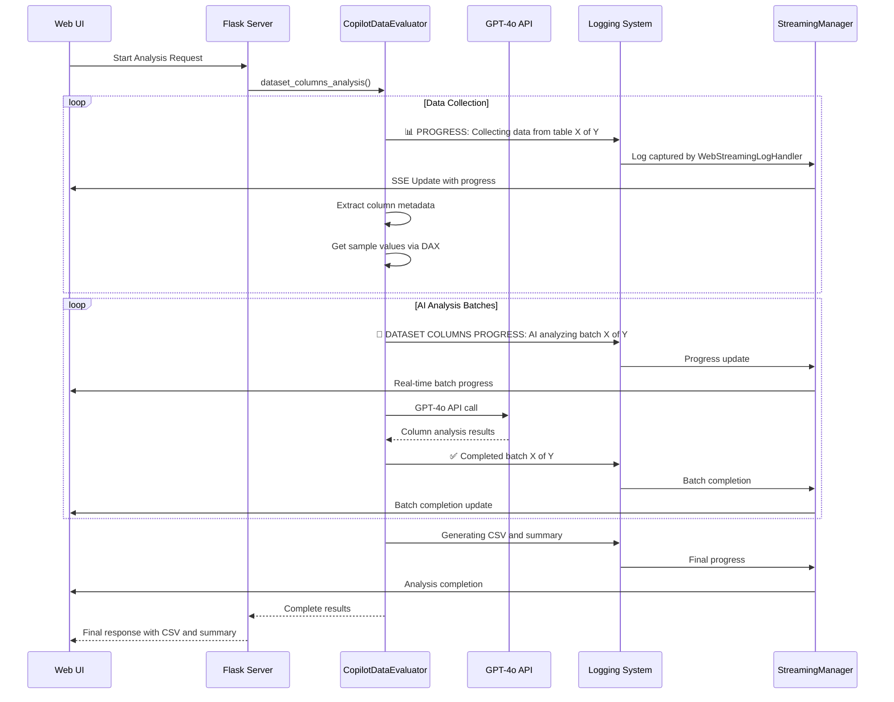

# Dataset Columns Analysis - Implementation Design & Improvements

## Current Architecture Flow

```mermaid
graph TD
    A[User Initiates Analysis] --> B[Method Entry: dataset_columns_analysis]
    B --> C[Initialize AI Client & Validate Connection]
    C --> D[Extract Workspace & Dataset Info]
    D --> E[Apply Table Filtering & Prioritization]
    E --> F[Data Collection Phase]
    
    F --> G[For Each Table Loop]
    G --> H[Check Cancellation Flag]
    H --> I[Log Progress: Collecting data from table X of Y]
    I --> J[Apply Column Sampling if needed]
    J --> K[Extract Column Metadata]
    K --> L[Get Sample Values via DAX]
    L --> M[Send Progress Update]
    M --> N{More Tables?}
    N -->|Yes| G
    N -->|No| O[AI Analysis Phase]
    
    O --> P[Build Dataset Context]
    P --> Q[Create Batches of 15-25 columns]
    Q --> R[For Each Batch Loop]
    R --> S[Check Cancellation Flag]
    S --> T[Build Column Name Mapping]
    T --> U[Create AI Prompt]
    U --> V[Call GPT-4o API]
    V --> W[Process AI Response]
    W --> X[Calculate Scores & Severity]
    X --> Y[Log Batch Completion]
    Y --> Z{More Batches?}
    Z -->|Yes| R
    Z -->|No| AA[Results Processing]
    
    AA --> BB[Generate CSV File]
    BB --> CC[Calculate Statistics]
    CC --> DD[Generate Key Findings]
    DD --> EE[Generate Recommendations]
    EE --> FF[Assemble Final Response]
    FF --> GG[Return to UI]
```



## Progress Tracking Flow



## Current Issues & Improvement Areas

### 1. **Progress Granularity Issues**

**Current Problem:**
```python
# Progress jumps in large chunks - not granular enough
progress_message = f"Collecting data from table {table_idx} of {total_tables}: {table_name}"
logger.info(f"📊 PROGRESS: {progress_message}")
```

**Proposed Solution:**
```python
def _send_detailed_progress(self, phase: str, sub_step: str, current: int, total: int, 
                           table_name: str = None, column_name: str = None):
    """Enhanced progress tracking with sub-steps"""
    percentage = round((current / total) * 100, 1)
    
    if table_name and column_name:
        message = f"{phase}: {sub_step} - {table_name}.{column_name} ({current}/{total})"
    elif table_name:
        message = f"{phase}: {sub_step} - {table_name} ({current}/{total})"
    else:
        message = f"{phase}: {sub_step} ({current}/{total})"
    
    # Send to multiple logging channels
    logger.info(f"📊 DETAILED_PROGRESS: {message} ({percentage}%)")
    
    if self.progress_callback:
        self.progress_callback({
            "type": "detailed_progress",
            "phase": phase,
            "sub_step": sub_step,
            "message": message,
            "current": current,
            "total": total,
            "percentage": percentage,
            "table_name": table_name,
            "column_name": column_name,
            "timestamp": time.time()
        })
```

### 2. **AI Analysis Bottleneck**

**Current Problem:**
- Sequential AI API calls create bottlenecks
- No parallel processing of batches
- No caching of similar column analyses

**Proposed Solution:**
```python
import asyncio
import aiohttp
from functools import lru_cache

class EnhancedColumnAnalyzer:
    def __init__(self):
        self.analysis_cache = {}
        self.session_pool = None
    
    async def analyze_columns_parallel(self, column_batches, max_concurrent=3):
        """Process multiple batches in parallel with controlled concurrency"""
        semaphore = asyncio.Semaphore(max_concurrent)
        
        async def analyze_batch_with_semaphore(batch):
            async with semaphore:
                return await self.analyze_single_batch_async(batch)
        
        tasks = [analyze_batch_with_semaphore(batch) for batch in column_batches]
        results = await asyncio.gather(*tasks, return_exceptions=True)
        return results
    
    @lru_cache(maxsize=500)
    def get_column_signature(self, table_name: str, column_name: str, 
                           data_type: str, sample_values: tuple) -> str:
        """Create a unique signature for column caching"""
        return f"{table_name}:{column_name}:{data_type}:{hash(sample_values)}"
    
    def get_cached_analysis(self, column_signature: str):
        """Return cached analysis if available"""
        return self.analysis_cache.get(column_signature)
    
    def cache_analysis(self, column_signature: str, analysis_result: dict):
        """Cache analysis result for future use"""
        self.analysis_cache[column_signature] = analysis_result
```

### 3. **Enhanced Error Handling**

**Current Problem:**
- Basic error handling with generic messages
- No retry logic for AI API failures
- Limited error context for debugging

**Proposed Solution:**
```python
import backoff
from typing import Optional

class RobustAnalysisEngine:
    def __init__(self):
        self.max_retries = 3
        self.error_context = {}
    
    @backoff.on_exception(
        backoff.expo,
        Exception,
        max_tries=3,
        max_time=300,
        jitter=backoff.random_jitter
    )
    async def robust_ai_analysis(self, batch_data: dict, attempt: int = 1):
        """AI analysis with exponential backoff retry"""
        try:
            self._log_attempt(attempt, batch_data)
            result = await self.call_ai_api(batch_data)
            self._log_success(attempt, batch_data)
            return result
        except Exception as e:
            self._log_error(attempt, batch_data, e)
            if attempt >= self.max_retries:
                return self._generate_fallback_analysis(batch_data, e)
            raise
    
    def _generate_fallback_analysis(self, batch_data: dict, error: Exception) -> dict:
        """Generate basic analysis when AI fails"""
        fallback_results = []
        for column in batch_data.get('columns', []):
            fallback_results.append({
                "column_name": column.get('column_name', 'Unknown'),
                "table_name": column.get('table_name', 'Unknown'),
                "current_data_type": column.get('data_type', 'Unknown'),
                "issue_severity": "warning",
                "is_unambiguous_label": "UNKNOWN - AI analysis failed",
                "is_self_explanatory": "UNKNOWN - AI analysis failed",
                "suggested_data_type": column.get('data_type', 'Unknown'),
                "suggested_name": column.get('column_name', 'Unknown'),
                "detailed_recommendation": f"AI analysis failed: {str(error)}. Manual review recommended.",
                "cn_001_score": 0.175,  # 50% of max
                "cn_002_score": 0.150,  # 50% of max
                "cn_003_score": 0.125,  # 50% of max
                "cn_004_score": 0.050,  # 50% of max
                "ct_001_score": 0.500,  # 50% of max
                "overall_score": 1.000,  # 50% of total
                "ai_analysis_status": "failed",
                "error_details": str(error)
            })
        return {"results": fallback_results}
```

### 4. **Real-time UI Enhancements**

**Current Problem:**
- Limited real-time feedback granularity
- No ETA calculations
- No visual progress indicators for specific phases

**Proposed Solution:**

**Enhanced Progress Callback:**
```python
class ProgressTracker:
    def __init__(self, total_phases: int = 4):
        self.total_phases = total_phases
        self.current_phase = 0
        self.phase_weights = {
            "initialization": 0.05,    # 5%
            "data_collection": 0.30,   # 30%
            "ai_analysis": 0.50,       # 50%
            "results_processing": 0.15  # 15%
        }
        self.start_time = time.time()
        self.phase_start_times = {}
    
    def start_phase(self, phase_name: str):
        self.current_phase += 1
        self.phase_start_times[phase_name] = time.time()
        
        progress_data = {
            "type": "phase_start",
            "phase_name": phase_name,
            "phase_number": self.current_phase,
            "total_phases": self.total_phases,
            "overall_percentage": self._calculate_overall_percentage(0),
            "estimated_time_remaining": self._calculate_eta(),
            "timestamp": time.time()
        }
        
        if self.progress_callback:
            self.progress_callback(progress_data)
    
    def update_phase_progress(self, phase_name: str, current: int, total: int, details: str = ""):
        phase_percentage = (current / total) * 100 if total > 0 else 0
        overall_percentage = self._calculate_overall_percentage(phase_percentage, phase_name)
        
        progress_data = {
            "type": "phase_progress",
            "phase_name": phase_name,
            "phase_percentage": round(phase_percentage, 1),
            "overall_percentage": round(overall_percentage, 1),
            "current": current,
            "total": total,
            "details": details,
            "estimated_time_remaining": self._calculate_eta(),
            "timestamp": time.time()
        }
        
        if self.progress_callback:
            self.progress_callback(progress_data)
    
    def _calculate_overall_percentage(self, phase_percentage: float, phase_name: str = None) -> float:
        """Calculate overall progress across all phases"""
        completed_weight = 0
        for i, (name, weight) in enumerate(self.phase_weights.items()):
            if i < self.current_phase - 1:
                completed_weight += weight
            elif name == phase_name:
                completed_weight += weight * (phase_percentage / 100)
        
        return completed_weight * 100
    
    def _calculate_eta(self) -> Optional[int]:
        """Calculate estimated time remaining in seconds"""
        if self.current_phase == 0:
            return None
        
        elapsed = time.time() - self.start_time
        progress_ratio = self._calculate_overall_percentage(0) / 100
        
        if progress_ratio > 0:
            estimated_total = elapsed / progress_ratio
            return int(estimated_total - elapsed)
        return None
```

**Enhanced Frontend JavaScript:**
```javascript
class AnalysisProgressTracker {
    constructor(containerId) {
        this.container = document.getElementById(containerId);
        this.phases = ['Initialization', 'Data Collection', 'AI Analysis', 'Results Processing'];
        this.currentPhase = 0;
        this.startTime = Date.now();
        this.initializeUI();
    }
    
    initializeUI() {
        this.container.innerHTML = `
            <div class="analysis-progress-container">
                <div class="overall-progress">
                    <div class="progress-bar">
                        <div class="progress-fill" id="overall-progress-fill"></div>
                    </div>
                    <div class="progress-text" id="overall-progress-text">0%</div>
                </div>
                
                <div class="phases-container">
                    ${this.phases.map((phase, index) => `
                        <div class="phase-item" id="phase-${index}">
                            <div class="phase-icon" id="phase-icon-${index}">⏳</div>
                            <div class="phase-name">${phase}</div>
                            <div class="phase-progress">
                                <div class="mini-progress-bar">
                                    <div class="mini-progress-fill" id="phase-progress-${index}"></div>
                                </div>
                                <span class="mini-progress-text" id="phase-text-${index}">0%</span>
                            </div>
                        </div>
                    `).join('')}
                </div>
                
                <div class="details-section">
                    <div class="current-activity" id="current-activity">Initializing...</div>
                    <div class="eta-display" id="eta-display">Calculating ETA...</div>
                </div>
            </div>
        `;
    }
    
    updateProgress(progressData) {
        const { type, phase_name, overall_percentage, phase_percentage, details, estimated_time_remaining } = progressData;
        
        // Update overall progress
        document.getElementById('overall-progress-fill').style.width = `${overall_percentage}%`;
        document.getElementById('overall-progress-text').textContent = `${overall_percentage}%`;
        
        // Update phase-specific progress
        if (type === 'phase_start') {
            this.startPhase(phase_name);
        } else if (type === 'phase_progress') {
            this.updatePhaseProgress(phase_name, phase_percentage, details);
        }
        
        // Update ETA
        if (estimated_time_remaining) {
            document.getElementById('eta-display').textContent = `ETA: ${this.formatTime(estimated_time_remaining)}`;
        }
    }
    
    startPhase(phaseName) {
        const phaseIndex = this.phases.findIndex(p => p.toLowerCase().replace(' ', '_') === phaseName);
        if (phaseIndex !== -1) {
            // Mark previous phases as complete
            for (let i = 0; i < phaseIndex; i++) {
                document.getElementById(`phase-icon-${i}`).textContent = '✅';
                document.getElementById(`phase-${i}`).classList.add('completed');
            }
            
            // Mark current phase as active
            document.getElementById(`phase-icon-${phaseIndex}`).textContent = '🔄';
            document.getElementById(`phase-${phaseIndex}`).classList.add('active');
        }
    }
    
    updatePhaseProgress(phaseName, percentage, details) {
        const phaseIndex = this.phases.findIndex(p => p.toLowerCase().replace(' ', '_') === phaseName);
        if (phaseIndex !== -1) {
            document.getElementById(`phase-progress-${phaseIndex}`).style.width = `${percentage}%`;
            document.getElementById(`phase-text-${phaseIndex}`).textContent = `${percentage}%`;
        }
        
        if (details) {
            document.getElementById('current-activity').textContent = details;
        }
    }
    
    formatTime(seconds) {
        const minutes = Math.floor(seconds / 60);
        const remainingSeconds = seconds % 60;
        return `${minutes}m ${remainingSeconds}s`;
    }
}
```

### 5. **Enhanced CSV Output & Analytics**

**Current Problem:**
- Basic CSV with limited analytics
- No data visualization options
- Missing comparative analysis

**Proposed Solution:**
```python
class EnhancedResultsProcessor:
    def generate_enhanced_csv(self, analysis_results: List[Dict], workspace_info: Dict) -> Dict:
        """Generate CSV with enhanced analytics and visualizations"""
        df = pd.DataFrame(analysis_results)
        
        # Add calculated fields
        df['Score_Percentage'] = (df['Overall_score'] / df['Max_Score']) * 100
        df['Improvement_Potential'] = df['Max_Score'] - df['Overall_score']
        df['Priority_Rank'] = df.groupby('Table_Name')['Overall_score'].rank(method='min')
        
        # Generate analytics sheets
        analytics_data = {
            'main_analysis': df,
            'summary_by_table': self._generate_table_summary(df),
            'summary_by_severity': self._generate_severity_summary(df),
            'improvement_recommendations': self._generate_improvement_plan(df),
            'column_patterns': self._analyze_column_patterns(df)
        }
        
        return self._create_multi_sheet_excel(analytics_data, workspace_info)
    
    def _generate_table_summary(self, df: pd.DataFrame) -> pd.DataFrame:
        """Generate table-level summary statistics"""
        table_summary = df.groupby('Table_Name').agg({
            'Column_Name': 'count',
            'Overall_score': ['mean', 'min', 'max'],
            'Issue_Severity': lambda x: (x == 'critical').sum(),
            'Score_Percentage': 'mean'
        }).round(2)
        
        table_summary.columns = ['Total_Columns', 'Avg_Score', 'Min_Score', 'Max_Score', 'Critical_Issues', 'Avg_Percentage']
        return table_summary.reset_index()
    
    def _create_dashboard_data(self, analysis_results: List[Dict]) -> Dict:
        """Create data structure for dashboard visualization"""
        return {
            'severity_distribution': self._get_severity_distribution(analysis_results),
            'rule_performance': self._get_rule_performance(analysis_results),
            'table_health_scores': self._get_table_health_scores(analysis_results),
            'improvement_timeline': self._generate_improvement_timeline(analysis_results),
            'pattern_analysis': self._analyze_naming_patterns(analysis_results)
        }
```

## Implementation Priority Recommendations

### Phase 1: Immediate Improvements (1-2 weeks)
1. **Enhanced Progress Tracking**: Implement detailed progress with sub-steps
2. **Better Error Handling**: Add retry logic and fallback analysis
3. **UI Progress Enhancements**: Real-time phase tracking with ETA

### Phase 2: Performance Optimizations (2-3 weeks)
1. **Async AI Processing**: Parallel batch processing
2. **Caching Layer**: Cache similar column analyses
3. **Memory Optimization**: Streaming results processing

### Phase 3: Advanced Features (3-4 weeks)
1. **Enhanced Analytics**: Multi-sheet Excel output with charts
2. **Pattern Recognition**: Advanced column pattern analysis
3. **Comparative Analysis**: Historical trend analysis

### Phase 4: Enterprise Features (4-6 weeks)
1. **Batch Analysis**: Multiple datasets simultaneously
2. **Custom Rules**: User-defined scoring criteria
3. **Integration APIs**: REST APIs for external systems

This comprehensive design approach will significantly improve the user experience, performance, and functionality of the dataset columns analysis feature.